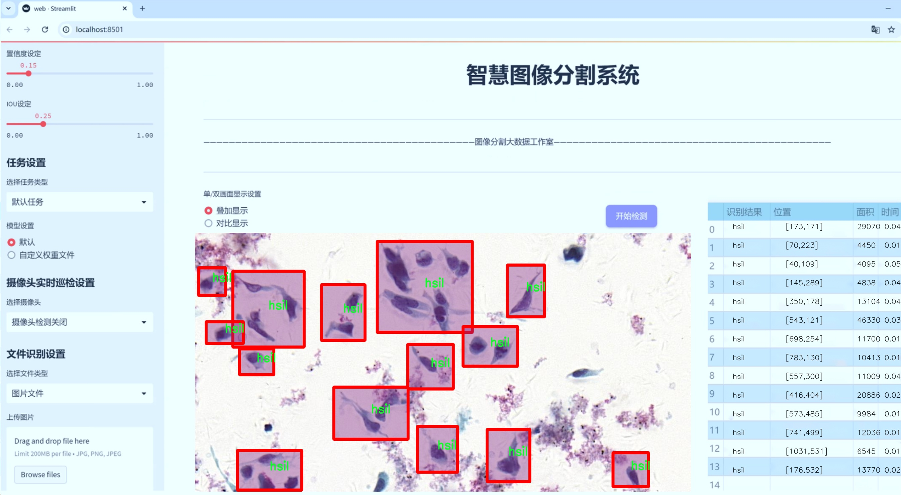
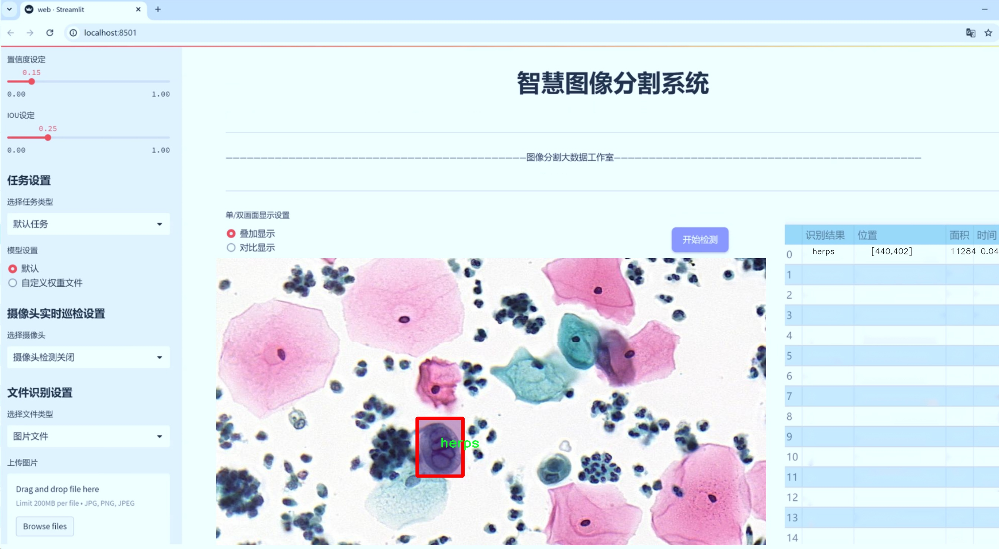
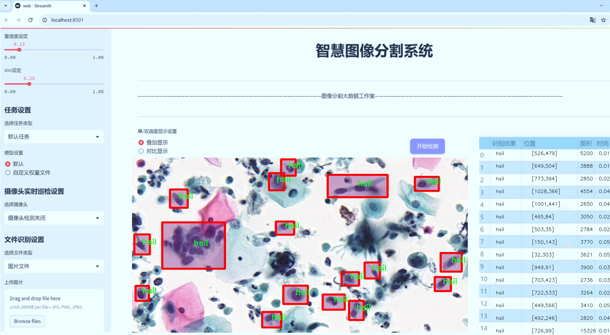
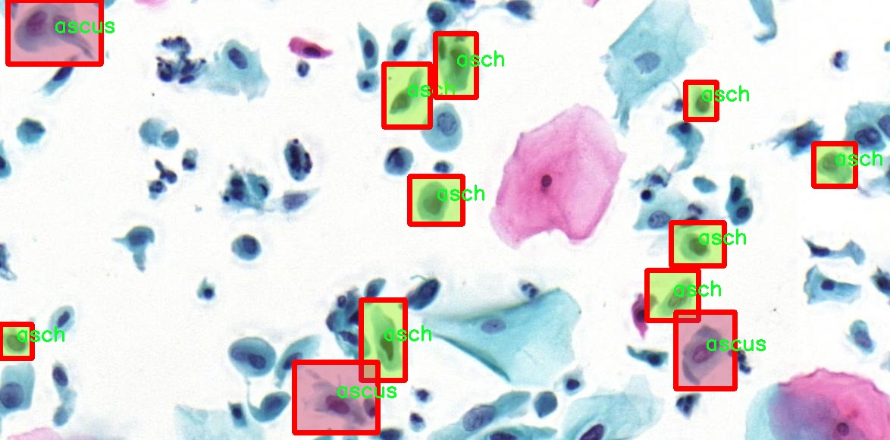
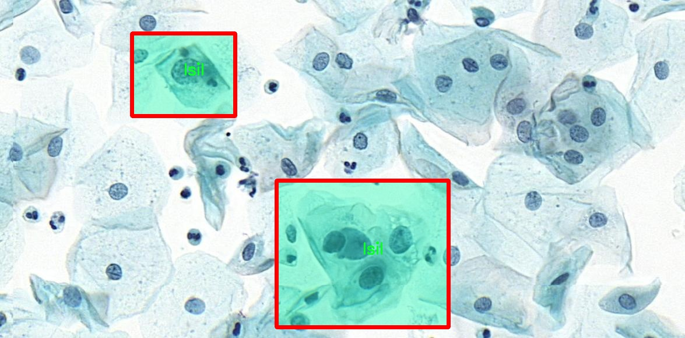
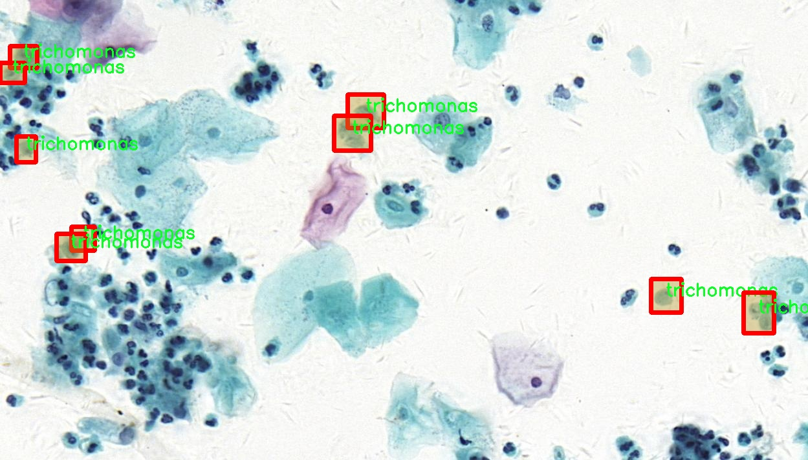
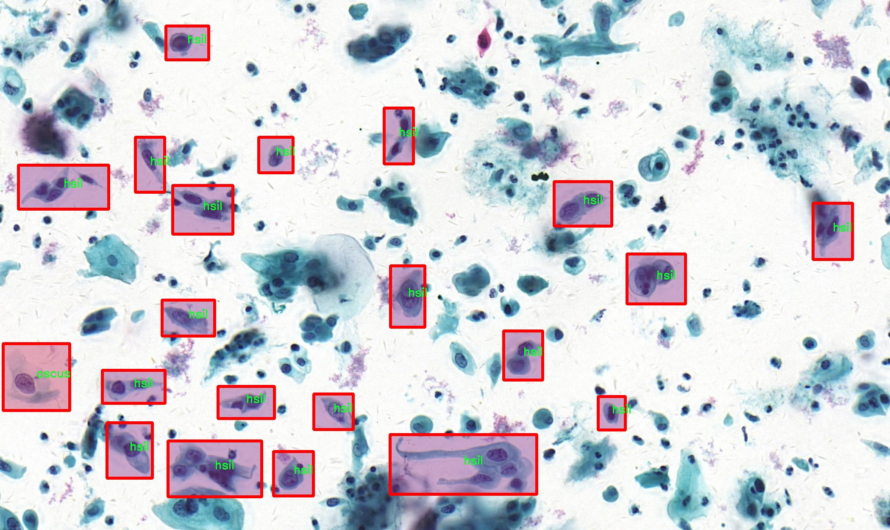
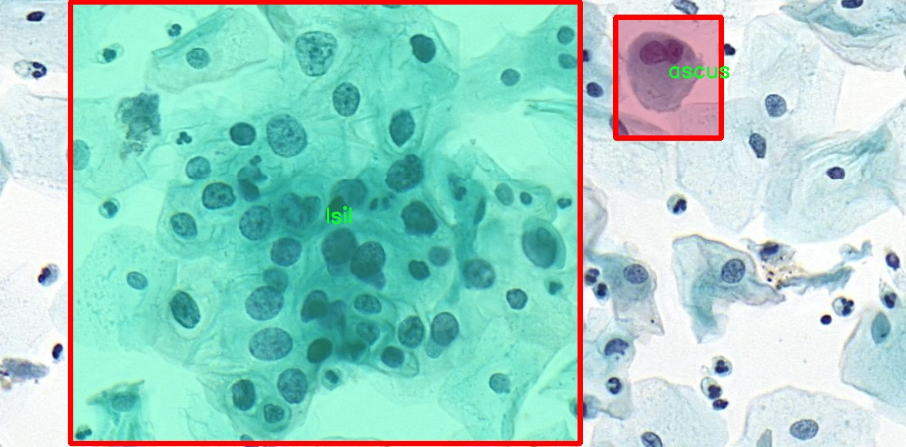

# 微生物图像分割系统： yolov8-seg-act

### 1.研究背景与意义

[参考博客](https://gitee.com/YOLOv8_YOLOv11_Segmentation_Studio/projects)

[博客来源](https://kdocs.cn/l/cszuIiCKVNis)

研究背景与意义

随着微生物学的迅速发展，微生物在医学、环境科学和食品安全等领域的重要性日益凸显。微生物的种类繁多，其形态和特征的多样性使得微生物的识别和分类成为一项复杂而具有挑战性的任务。传统的微生物鉴定方法通常依赖于显微镜观察和人工分类，这不仅耗时耗力，而且容易受到人为因素的影响，导致识别结果的不准确性。因此，开发一种高效、准确的微生物图像分割系统显得尤为重要。

近年来，深度学习技术的快速发展为图像处理领域带来了革命性的变化，尤其是在目标检测和图像分割方面。YOLO（You Only Look Once）系列模型因其高效的实时检测能力和较高的准确性，已成为计算机视觉领域的研究热点。YOLOv8作为该系列的最新版本，结合了多种先进的技术，具有更强的特征提取能力和更快的推理速度。然而，尽管YOLOv8在一般目标检测任务中表现出色，但在微生物图像分割这一特定领域，仍然存在一些挑战，如微生物形态的复杂性、图像背景的多样性以及微生物之间的相似性等。

本研究旨在基于改进的YOLOv8模型，构建一个高效的微生物图像分割系统。我们使用的数据集包含3400幅图像，涵盖11个不同的微生物类别，包括放线菌、念珠菌、草履虫等。这些类别的选择不仅反映了微生物在生态系统中的多样性，也体现了它们在临床和环境监测中的重要性。通过对这些图像进行深度学习训练，我们期望模型能够自动识别和分割不同类别的微生物，从而提高微生物鉴定的效率和准确性。

本研究的意义在于，首先，通过改进YOLOv8模型，我们将为微生物图像分割提供一种新的解决方案，推动微生物学领域的自动化和智能化进程。其次，微生物图像分割系统的建立将为相关领域的研究提供强有力的工具，促进微生物的分类、鉴定和功能研究。此外，准确的微生物识别和分割将有助于提高疾病诊断的效率，降低误诊率，进而改善患者的治疗效果。

综上所述，基于改进YOLOv8的微生物图像分割系统不仅具有重要的学术价值，还有助于推动微生物学的应用研究，为公共卫生、生态保护和食品安全等领域提供有力支持。随着研究的深入，我们期待该系统能够在实际应用中展现出其独特的优势，为微生物的快速鉴定和分类提供可靠的技术保障。

### 2.图片演示







注意：本项目提供完整的训练源码数据集和训练教程,由于此博客编辑较早,暂不提供权重文件（best.pt）,需要按照6.训练教程进行训练后实现上图效果。

### 3.视频演示

[3.1 视频演示](https://www.bilibili.com/video/BV16Gz8Y9Eza/)

### 4.数据集信息

##### 4.1 数据集类别数＆类别名

nc: 11
names: ['actinomyces', 'agc', 'asch', 'ascus', 'candida', 'flora', 'herps', 'hsil', 'lsil', 'scc', 'trichomonas']


##### 4.2 数据集信息简介

数据集信息展示

在微生物图像分割的研究领域，"instanceseg"数据集作为一个重要的资源，专门用于训练和改进YOLOv8-seg模型，以实现更高效的微生物图像识别和分割。该数据集包含11个类别，涵盖了多种微生物类型，为研究人员提供了丰富的样本，以便在实际应用中提升模型的准确性和鲁棒性。

具体而言，"instanceseg"数据集中的类别包括：actinomyces、agc、asch、ascus、candida、flora、herps、hsil、lsil、scc和trichomonas。这些类别代表了不同类型的微生物，每种微生物在形态、结构和生物学特性上都有其独特之处。通过对这些微生物的图像进行标注和分类，研究人员能够训练出更为精准的分割模型，从而在临床诊断、环境监测和生物研究等多个领域发挥重要作用。

数据集的构建过程注重样本的多样性和代表性，确保涵盖了不同生长环境、不同光照条件以及不同放大倍数下的微生物图像。这种多样性不仅提高了模型的泛化能力，还能有效应对实际应用中可能遇到的各种挑战。例如，actinomyces作为一种常见的细菌，其在口腔和呼吸道中的存在与多种疾病密切相关，因此在数据集中提供了大量的actinomyces图像，以便模型能够准确识别和分割该微生物。

同时，candida和trichomonas等真菌和原生动物的图像也被纳入数据集中，这些微生物在临床上同样具有重要的诊断价值。通过对这些类别的深入学习，YOLOv8-seg模型能够在实际应用中提供更为可靠的分割结果，帮助医生更好地进行疾病的诊断和治疗。

此外，数据集的标注工作由经验丰富的微生物学专家完成，确保了每个图像的标注准确无误。这一过程不仅包括对微生物的分类，还涉及到对其形态特征的详细描述，从而为模型提供了丰富的上下文信息。这种精细化的标注方式，使得训练出的模型在面对复杂的微生物图像时，能够更好地理解和识别不同类别之间的细微差别。

总之，"instanceseg"数据集为微生物图像分割提供了一个坚实的基础，结合YOLOv8-seg模型的强大能力，研究人员有望在微生物识别和分割领域取得突破性进展。随着技术的不断发展和数据集的不断完善，未来的微生物图像分析将更加精准、高效，为相关领域的研究和应用提供更为强大的支持。











### 5.项目依赖环境部署教程（零基础手把手教学）

[5.1 环境部署教程链接（零基础手把手教学）](https://www.bilibili.com/video/BV1jG4Ve4E9t/?vd_source=bc9aec86d164b67a7004b996143742dc)


[5.2 安装Python虚拟环境创建和依赖库安装视频教程链接（零基础手把手教学）](https://www.bilibili.com/video/BV1nA4VeYEze/?vd_source=bc9aec86d164b67a7004b996143742dc)

### 6.手把手YOLOV8-seg训练视频教程（零基础手把手教学）

[6.1 手把手YOLOV8-seg训练视频教程（零基础小白有手就能学会）](https://www.bilibili.com/video/BV1cA4VeYETe/?vd_source=bc9aec86d164b67a7004b996143742dc)


按照上面的训练视频教程链接加载项目提供的数据集，运行train.py即可开始训练



     Epoch   gpu_mem       box       obj       cls    labels  img_size
     1/200     0G   0.01576   0.01955  0.007536        22      1280: 100%|██████████| 849/849 [14:42<00:00,  1.04s/it]
               Class     Images     Labels          P          R     mAP@.5 mAP@.5:.95: 100%|██████████| 213/213 [01:14<00:00,  2.87it/s]
                 all       3395      17314      0.994      0.957      0.0957      0.0843

     Epoch   gpu_mem       box       obj       cls    labels  img_size
     2/200     0G   0.01578   0.01923  0.007006        22      1280: 100%|██████████| 849/849 [14:44<00:00,  1.04s/it]
               Class     Images     Labels          P          R     mAP@.5 mAP@.5:.95: 100%|██████████| 213/213 [01:12<00:00,  2.95it/s]
                 all       3395      17314      0.996      0.956      0.0957      0.0845

     Epoch   gpu_mem       box       obj       cls    labels  img_size
     3/200     0G   0.01561    0.0191  0.006895        27      1280: 100%|██████████| 849/849 [10:56<00:00,  1.29it/s]
               Class     Images     Labels          P          R     mAP@.5 mAP@.5:.95: 100%|███████   | 187/213 [00:52<00:00,  4.04it/s]
                 all       3395      17314      0.996      0.957      0.0957      0.0845


### 7.50+种全套YOLOV8-seg创新点加载调参实验视频教程（一键加载写好的改进模型的配置文件）

[7.1 50+种全套YOLOV8-seg创新点加载调参实验视频教程（一键加载写好的改进模型的配置文件）](https://www.bilibili.com/video/BV1Hw4VePEXv/?vd_source=bc9aec86d164b67a7004b996143742dc)

### YOLOV8-seg算法简介

原始YOLOv8-seg算法原理

YOLOv8-seg算法是YOLO系列中的最新版本，专注于目标检测和图像分割任务，具有更高的精度和更快的处理速度。该算法在YOLOv8的基础上，结合了深度学习的最新技术和方法，形成了一种高效的图像处理框架。YOLOv8-seg的核心在于其独特的网络结构和无锚框的检测机制，这使得它在处理复杂场景时表现出色。

YOLOv8-seg的网络结构主要由三个部分组成：Backbone、Neck和Head。Backbone部分负责特征提取，采用了CSPDarknet结构，通过引入C2f模块来替代传统的C3模块。C2f模块的设计理念是将输入特征图分为两个分支，每个分支经过卷积层进行降维处理，进而增强了网络的梯度流动。这种结构不仅提高了特征提取的效率，还有效地减少了模型的参数量，使得YOLOv8-seg在保持高精度的同时，能够在资源受限的环境中运行。

在特征提取的过程中，YOLOv8-seg引入了快速空间金字塔池化（SPPF）结构，以便于提取不同尺度的特征。这一结构的优势在于它能够在不显著增加计算量的情况下，提升特征提取的多样性和准确性。通过对多尺度特征的有效整合，YOLOv8-seg能够更好地应对目标大小变化和复杂背景的挑战。

Neck部分则采用了特征金字塔网络（FPN）和路径聚合网络（PAN）的组合，进一步增强了特征的表达能力。通过多层卷积和池化操作，Neck部分将来自Backbone的特征图进行处理和压缩，最终形成高质量的特征表示。这些特征不仅包含了丰富的空间信息，还能有效地支持后续的目标检测和分割任务。

YOLOv8-seg的Head部分是其创新的核心，采用了解耦头（Decoupled-Head）结构。与传统的耦合头不同，解耦头将目标检测和分类任务分开处理，分别使用不同的卷积层进行特征降维和预测。这种设计使得模型在进行目标检测时，能够更加专注于目标的位置和类别，从而提高了检测的准确性和效率。此外，YOLOv8-seg还采用了分布焦点损失（DFL）和CIoU损失的组合，进一步优化了边界框的回归过程，使得模型能够快速聚焦于目标的真实位置。

YOLOv8-seg的另一大亮点在于其无锚框（Anchor-Free）的检测方式。传统的目标检测算法通常依赖于预设的锚框来进行目标定位，这种方法虽然在某些情况下有效，但也带来了计算复杂度高和灵活性不足的问题。YOLOv8-seg通过将目标检测转化为关键点检测，省去了锚框的预设和计算，显著简化了模型的结构。这种无锚框的设计不仅提高了模型的泛化能力，还使得YOLOv8-seg在处理不同类型的目标时，能够更加灵活和高效。

在实际应用中，YOLOv8-seg展现出了极强的适应性和灵活性。无论是在智能监控、自动驾驶还是人脸识别等领域，该算法都能够提供高质量的目标检测和分割结果。通过多尺度训练和测试，YOLOv8-seg能够有效地提升模型的性能，使其在复杂场景下依然保持高精度和高帧率的输出。

总的来说，YOLOv8-seg算法通过引入创新的网络结构和无锚框的检测机制，成功地提升了目标检测和图像分割的性能。其高效的特征提取能力、灵活的结构设计以及优秀的适应性，使得YOLOv8-seg成为当前目标检测领域中的一项重要进展。随着深度学习技术的不断发展，YOLOv8-seg有望在更多应用场景中发挥其独特的优势，为相关领域的研究和实践提供更为强大的支持。


### 9.系统功能展示（检测对象为举例，实际内容以本项目数据集为准）

图9.1.系统支持检测结果表格显示

  图9.2.系统支持置信度和IOU阈值手动调节

  图9.3.系统支持自定义加载权重文件best.pt(需要你通过步骤5中训练获得)

  图9.4.系统支持摄像头实时识别

  图9.5.系统支持图片识别

  图9.6.系统支持视频识别

  图9.7.系统支持识别结果文件自动保存

  图9.8.系统支持Excel导出检测结果数据


### 10.50+种全套YOLOV8-seg创新点原理讲解（非科班也可以轻松写刊发刊，V11版本正在科研待更新）

#### 10.1 由于篇幅限制，每个创新点的具体原理讲解就不一一展开，具体见下列网址中的创新点对应子项目的技术原理博客网址【Blog】：


[10.1 50+种全套YOLOV8-seg创新点原理讲解链接](https://gitee.com/qunmasj/good)

#### 10.2 部分改进模块原理讲解(完整的改进原理见上图和技术博客链接)【如果此小节的图加载失败可以通过CSDN或者Github搜索该博客的标题访问原始博客，原始博客图片显示正常】

### Gold-YOLO简介
YOLO再升级：华为诺亚提出Gold-YOLO，聚集-分发机制打造新SOTA
在过去的几年中，YOLO系列模型已经成为实时目标检测领域的领先方法。许多研究通过修改架构、增加数据和设计新的损失函数，将基线推向了更高的水平。然而以前的模型仍然存在信息融合问题，尽管特征金字塔网络（FPN）和路径聚合网络（PANet）已经在一定程度上缓解了这个问题。因此，本研究提出了一种先进的聚集和分发机制（GD机制），该机制通过卷积和自注意力操作实现。这种新设计的模型被称为Gold-YOLO，它提升了多尺度特征融合能力，在所有模型尺度上实现了延迟和准确性的理想平衡。此外，本文首次在YOLO系列中实现了MAE风格的预训练，使得YOLO系列模型能够从无监督预训练中受益。Gold-YOLO-N在COCO val2017数据集上实现了出色的39.9% AP，并在T4 GPU上实现了1030 FPS，超过了之前的SOTA模型YOLOv6-3.0-N，其FPS相似，但性能提升了2.4%。


#### Gold-YOLO


YOLO系列的中间层结构采用了传统的FPN结构，其中包含多个分支用于多尺度特征融合。然而，它只充分融合来自相邻级别的特征，对于其他层次的信息只能间接地进行“递归”获取。

传统的FPN结构在信息传输过程中存在丢失大量信息的问题。这是因为层之间的信息交互仅限于中间层选择的信息，未被选择的信息在传输过程中被丢弃。这种情况导致某个Level的信息只能充分辅助相邻层，而对其他全局层的帮助较弱。因此，整体上信息融合的有效性可能受到限制。
为了避免在传输过程中丢失信息，本文采用了一种新颖的“聚集和分发”机制（GD），放弃了原始的递归方法。该机制使用一个统一的模块来收集和融合所有Level的信息，并将其分发到不同的Level。通过这种方式，作者不仅避免了传统FPN结构固有的信息丢失问题，还增强了中间层的部分信息融合能力，而且并没有显著增加延迟。


# 8.低阶聚合和分发分支 Low-stage gather-and-distribute branch
从主干网络中选择输出的B2、B3、B4、B5特征进行融合，以获取保留小目标信息的高分辨率特征。


低阶特征对齐模块 (Low-stage feature alignment module)： 在低阶特征对齐模块（Low-FAM）中，采用平均池化（AvgPool）操作对输入特征进行下采样，以实现统一的大小。通过将特征调整为组中最小的特征大小（ R B 4 = 1 / 4 R ） （R_{B4} = 1/4R）（R 
B4 =1/4R），我们得到对齐后的特征F a l i g n F_{align}F align 。低阶特征对齐技术确保了信息的高效聚合，同时通过变换器模块来最小化后续处理的计算复杂性。其中选择 R B 4 R_{B4}R B4 作为特征对齐的目标大小主要基于保留更多的低层信息的同时不会带来较大的计算延迟。
低阶信息融合模块(Low-stage information fusion module)： 低阶信息融合模块（Low-IFM）设计包括多层重新参数化卷积块（RepBlock）和分裂操作。具体而言，RepBlock以F a l i g n ( c h a n n e l = s u m ( C B 2 ， C B 3 ， C B 4 ， C B 5 ) ) F_{align} (channel= sum(C_{B2}，C_{B3}，C_{B4}，C_{B5}))F align (channel=sum(C B2 ，C B3 ，C B4 ，C B5 )作为输入，并生成F f u s e ( c h a n n e l = C B 4 + C B 5 ) F_{fuse} (channel= C_{B4} + C_{B5})F fuse (channel=C B4 +C B5 )。其中中间通道是一个可调整的值（例如256），以适应不同的模型大小。由RepBlock生成的特征随后在通道维度上分裂为F i n j P 3 Finj_P3Finj P 3和F i n j P 4 Finj_P4Finj P 4，然后与不同级别的特征进行融合。


# 8.高阶聚合和分发分支 High-stage gather-and-distribute branch
高级全局特征对齐模块（High-GD）将由低级全局特征对齐模块（Low-GD）生成的特征{P3, P4, P5}进行融合。


高级特征对齐模块(High-stage feature alignment module)： High-FAM由avgpool组成，用于将输入特征的维度减小到统一的尺寸。具体而言，当输入特征的尺寸为{R P 3 R_{P3}R P3 , R P 4 R_{P4}R P4 , R P 5 R_{P 5}R P5 }时，avgpool将特征尺寸减小到该特征组中最小的尺寸（R P 5 R_{P5}R P5  = 1/8R）。由于transformer模块提取了高层次的信息，池化操作有助于信息聚合，同时降低了transformer模块后续步骤的计算需求。

Transformer融合模块由多个堆叠的transformer组成，transformer块的数量为L。每个transformer块包括一个多头注意力块、一个前馈网络（FFN）和残差连接。采用与LeViT相同的设置来配置多头注意力块，使用16个通道作为键K和查询Q的头维度，32个通道作为值V的头维度。为了加速推理过程，将层归一化操作替换为批归一化，并将所有的GELU激活函数替换为ReLU。为了增强变换器块的局部连接，在两个1x1卷积层之间添加了一个深度卷积层。同时，将FFN的扩展因子设置为2，以在速度和计算成本之间取得平衡。

信息注入模块(Information injection module)： 高级全局特征对齐模块（High-GD）中的信息注入模块与低级全局特征对齐模块（Low-GD）中的相同。在高级阶段，局部特征（Flocal）等于Pi，因此公式如下所示：


### 增强的跨层信息流动 Enhanced cross-layer information flow
为了进一步提升性能，从YOLOv8 中的PAFPN模块中得到启发，引入了Inject-LAF模块。该模块是注入模块的增强版，包括了一个轻量级相邻层融合（LAF）模块，该模块被添加到注入模块的输入位置。为了在速度和准确性之间取得平衡，设计了两个LAF模型：LAF低级模型和LAF高级模型，分别用于低级注入（合并相邻两层的特征）和高级注入（合并相邻一层的特征）。它们的结构如图5(b)所示。为了确保来自不同层级的特征图与目标大小对齐，在实现中的两个LAF模型仅使用了三个操作符：双线性插值（上采样过小的特征）、平均池化（下采样过大的特征）和1x1卷积（调整与目标通道不同的特征）。模型中的LAF模块与信息注入模块的结合有效地平衡了准确性和速度之间的关系。通过使用简化的操作，能够增加不同层级之间的信息流路径数量，从而提高性能而不显著增加延迟。


### 11.项目核心源码讲解（再也不用担心看不懂代码逻辑）

#### 11.1 ultralytics\utils\callbacks\tensorboard.py

以下是经过精简和注释的核心代码部分：

```python
# 导入必要的库和模块
from ultralytics.utils import LOGGER, SETTINGS, TESTS_RUNNING, colorstr

try:
    # 尝试导入TensorBoard的SummaryWriter
    from torch.utils.tensorboard import SummaryWriter

    # 确保当前不是在测试环境中
    assert not TESTS_RUNNING  
    # 确保TensorBoard集成已启用
    assert SETTINGS['tensorboard'] is True  
    WRITER = None  # 初始化TensorBoard的SummaryWriter实例

except (ImportError, AssertionError, TypeError):
    # 捕获导入错误或断言错误
    SummaryWriter = None  # 如果导入失败，SummaryWriter设为None


def _log_scalars(scalars, step=0):
    """将标量值记录到TensorBoard中。"""
    if WRITER:  # 如果WRITER已初始化
        for k, v in scalars.items():  # 遍历标量字典
            WRITER.add_scalar(k, v, step)  # 记录标量值


def _log_tensorboard_graph(trainer):
    """将模型图记录到TensorBoard中。"""
    try:
        import warnings
        from ultralytics.utils.torch_utils import de_parallel, torch

        imgsz = trainer.args.imgsz  # 获取输入图像大小
        imgsz = (imgsz, imgsz) if isinstance(imgsz, int) else imgsz  # 确保图像大小为元组
        p = next(trainer.model.parameters())  # 获取模型参数以确定设备和类型
        im = torch.zeros((1, 3, *imgsz), device=p.device, dtype=p.dtype)  # 创建输入图像（必须为零）

        with warnings.catch_warnings():
            warnings.simplefilter('ignore', category=UserWarning)  # 忽略JIT跟踪警告
            WRITER.add_graph(torch.jit.trace(de_parallel(trainer.model), im, strict=False), [])  # 记录模型图
    except Exception as e:
        LOGGER.warning(f'WARNING ⚠️ TensorBoard图形可视化失败 {e}')  # 记录警告


def on_pretrain_routine_start(trainer):
    """初始化TensorBoard记录。"""
    if SummaryWriter:  # 如果SummaryWriter可用
        try:
            global WRITER
            WRITER = SummaryWriter(str(trainer.save_dir))  # 创建SummaryWriter实例
            prefix = colorstr('TensorBoard: ')
            LOGGER.info(f"{prefix}使用 'tensorboard --logdir {trainer.save_dir}' 启动，查看地址为 http://localhost:6006/")
        except Exception as e:
            LOGGER.warning(f'WARNING ⚠️ TensorBoard未正确初始化，未记录此运行. {e}')  # 记录警告


def on_train_start(trainer):
    """在训练开始时记录TensorBoard图形。"""
    if WRITER:  # 如果WRITER已初始化
        _log_tensorboard_graph(trainer)  # 记录模型图


def on_batch_end(trainer):
    """在训练批次结束时记录标量统计信息。"""
    _log_scalars(trainer.label_loss_items(trainer.tloss, prefix='train'), trainer.epoch + 1)  # 记录训练损失


def on_fit_epoch_end(trainer):
    """在训练周期结束时记录周期指标。"""
    _log_scalars(trainer.metrics, trainer.epoch + 1)  # 记录训练指标


# 定义回调函数字典
callbacks = {
    'on_pretrain_routine_start': on_pretrain_routine_start,
    'on_train_start': on_train_start,
    'on_fit_epoch_end': on_fit_epoch_end,
    'on_batch_end': on_batch_end
} if SummaryWriter else {}
```

### 代码核心部分分析
1. **导入和初始化**：
   - 导入了TensorBoard的`SummaryWriter`，用于记录训练过程中的标量和图形数据。
   - 通过断言确保在非测试环境中运行，并且TensorBoard集成已启用。

2. **记录标量**：
   - `_log_scalars`函数用于将训练过程中的标量数据（如损失）记录到TensorBoard。

3. **记录模型图**：
   - `_log_tensorboard_graph`函数用于记录模型的计算图，以便在TensorBoard中可视化。

4. **回调函数**：
   - 定义了一系列回调函数，在训练的不同阶段（如开始训练、每个批次结束、每个周期结束）调用相应的记录函数。

5. **全局回调字典**：
   - `callbacks`字典存储了所有的回调函数，以便在训练过程中根据需要调用。

通过这些核心部分，代码实现了在训练过程中将重要的指标和模型结构记录到TensorBoard，便于后续的可视化和分析。

这个文件是Ultralytics YOLO项目中的一个模块，主要用于将训练过程中的数据记录到TensorBoard中，以便于可视化和分析模型的训练情况。代码首先尝试导入TensorBoard的SummaryWriter类，并进行一些基本的设置和检查。如果导入失败或者条件不满足（如正在运行测试），则SummaryWriter会被设置为None。

在文件中定义了一些辅助函数。`_log_scalars`函数用于将标量值记录到TensorBoard中，接收一个字典类型的参数`scalars`，其中包含要记录的标量数据，以及一个步数参数`step`。函数内部会遍历字典，将每个标量值添加到TensorBoard中。

`_log_tensorboard_graph`函数用于将模型的计算图记录到TensorBoard。它首先获取输入图像的尺寸，并创建一个全零的张量作为输入。然后，使用PyTorch的JIT编译器对模型进行追踪，并将生成的计算图添加到TensorBoard中。如果在这个过程中发生异常，会记录一个警告信息。

接下来的几个函数是用于不同训练阶段的回调函数。`on_pretrain_routine_start`函数在训练前初始化TensorBoard的记录器，并输出一些提示信息，告诉用户如何查看TensorBoard的可视化界面。`on_train_start`函数在训练开始时调用，用于记录模型的计算图。`on_batch_end`函数在每个训练批次结束时调用，记录当前批次的损失统计信息。`on_fit_epoch_end`函数在每个训练周期结束时调用，记录该周期的指标。

最后，代码将这些回调函数组织成一个字典`callbacks`，如果SummaryWriter存在，则将这些函数作为回调函数进行注册，以便在训练过程中自动调用。整体来看，这个模块的主要功能是集成TensorBoard，以便于用户监控和分析YOLO模型的训练过程。

#### 11.2 ultralytics\data\utils.py

以下是代码中最核心的部分，并附上详细的中文注释：

```python
import os
import hashlib
from pathlib import Path
from PIL import Image, ImageOps
import numpy as np
import cv2

IMG_FORMATS = 'bmp', 'jpeg', 'jpg', 'png', 'tif', 'tiff'  # 支持的图像格式

def img2label_paths(img_paths):
    """根据图像路径定义标签路径。"""
    sa, sb = f'{os.sep}images{os.sep}', f'{os.sep}labels{os.sep}'  # 定义图像和标签的子字符串
    return [sb.join(x.rsplit(sa, 1)).rsplit('.', 1)[0] + '.txt' for x in img_paths]  # 返回标签路径

def get_hash(paths):
    """返回一组路径（文件或目录）的单一哈希值。"""
    size = sum(os.path.getsize(p) for p in paths if os.path.exists(p))  # 计算路径的总大小
    h = hashlib.sha256(str(size).encode())  # 基于大小生成哈希
    h.update(''.join(paths).encode())  # 基于路径生成哈希
    return h.hexdigest()  # 返回哈希值

def exif_size(img: Image.Image):
    """返回经过EXIF校正的PIL图像大小。"""
    s = img.size  # 获取图像的宽度和高度
    if img.format == 'JPEG':  # 仅支持JPEG格式的图像
        exif = img.getexif()  # 获取EXIF信息
        if exif:
            rotation = exif.get(274, None)  # 获取旋转信息
            if rotation in [6, 8]:  # 旋转270或90度
                s = s[1], s[0]  # 交换宽高
    return s

def verify_image(args):
    """验证单个图像的有效性。"""
    (im_file, cls), prefix = args  # 解包参数
    nf, nc, msg = 0, 0, ''  # 初始化计数器和消息
    try:
        im = Image.open(im_file)  # 打开图像文件
        im.verify()  # 验证图像
        shape = exif_size(im)  # 获取图像大小
        shape = (shape[1], shape[0])  # 转换为(height, width)格式
        assert (shape[0] > 9) & (shape[1] > 9), f'image size {shape} <10 pixels'  # 确保图像尺寸大于10像素
        assert im.format.lower() in IMG_FORMATS, f'invalid image format {im.format}'  # 确保图像格式有效
        nf = 1  # 图像有效计数
    except Exception as e:
        nc = 1  # 图像无效计数
        msg = f'{prefix}WARNING ⚠️ {im_file}: ignoring corrupt image: {e}'  # 记录错误消息
    return (im_file, cls), nf, nc, msg  # 返回结果

def polygon2mask(imgsz, polygons, color=1, downsample_ratio=1):
    """
    将多边形列表转换为指定图像大小的二进制掩码。

    Args:
        imgsz (tuple): 图像大小，格式为(height, width)。
        polygons (list[np.ndarray]): 多边形列表，每个多边形是一个数组。
        color (int, optional): 掩码中填充多边形的颜色值。默认为1。
        downsample_ratio (int, optional): 掩码下采样比例。默认为1。

    Returns:
        (np.ndarray): 指定图像大小的二进制掩码。
    """
    mask = np.zeros(imgsz, dtype=np.uint8)  # 创建空掩码
    polygons = np.asarray(polygons, dtype=np.int32)  # 转换为整数数组
    polygons = polygons.reshape((polygons.shape[0], -1, 2))  # 重塑多边形数组
    cv2.fillPoly(mask, polygons, color=color)  # 填充多边形
    nh, nw = (imgsz[0] // downsample_ratio, imgsz[1] // downsample_ratio)  # 计算下采样后的大小
    return cv2.resize(mask, (nw, nh))  # 返回下采样后的掩码

def check_det_dataset(dataset, autodownload=True):
    """
    检查检测数据集的有效性，必要时下载和解压数据集。

    Args:
        dataset (str): 数据集路径或描述。
        autodownload (bool, optional): 如果未找到数据集，是否自动下载。默认为True。

    Returns:
        (dict): 解析后的数据集信息和路径。
    """
    # 这里省略了一些具体实现，主要是检查数据集的存在性和有效性
    # 处理下载和解析YAML文件的逻辑
    # 最终返回一个包含数据集信息的字典
    pass  # 具体实现略去

# 其他函数和类的实现省略，主要关注数据集的验证和处理
```

以上代码片段包含了数据集处理的核心功能，包括图像验证、标签路径生成、哈希计算、多边形转掩码等功能，并对每个函数进行了详细的中文注释。

这个程序文件是Ultralytics YOLO项目中的一个工具模块，主要用于处理与数据集相关的各种操作。代码中导入了多个库和模块，涵盖了文件操作、图像处理、数据下载和多线程处理等功能。

文件中定义了一些常量和函数。首先，`IMG_FORMATS`和`VID_FORMATS`分别定义了支持的图像和视频文件格式。`PIN_MEMORY`用于设置数据加载器的内存管理选项。

`img2label_paths`函数根据图像路径生成对应的标签路径，标签文件的命名规则是将图像路径中的“images”替换为“labels”，并将文件扩展名改为“.txt”。

`get_hash`函数计算给定路径列表的哈希值，主要用于验证文件或目录的完整性。

`exif_size`函数用于获取图像的EXIF信息并返回正确的图像尺寸，特别是处理JPEG格式的图像时，会考虑图像的旋转信息。

`verify_image`和`verify_image_label`函数分别用于验证单个图像和图像-标签对的有效性。它们会检查图像是否损坏、格式是否正确，以及标签文件是否存在和有效。

`polygon2mask`和`polygons2masks`函数用于将多边形转换为二进制掩码，适用于图像分割任务。它们可以处理多个多边形并生成相应的掩码图像。

`find_dataset_yaml`函数用于查找与数据集相关的YAML文件，确保在指定路径下找到一个有效的YAML文件。

`check_det_dataset`和`check_cls_dataset`函数用于检查和验证检测和分类数据集的完整性。如果数据集未找到，可以选择自动下载并解压数据集，同时会解析YAML文件以确保必要的字段存在。

`HUBDatasetStats`类用于生成HUB数据集的统计信息，包括数据集的JSON文件和图像处理。该类会在初始化时检查数据集的有效性，并提供方法来生成统计信息和处理图像。

`compress_one_image`函数用于压缩单个图像文件，保持其宽高比和质量，同时限制最大尺寸。

`autosplit`函数用于自动将数据集拆分为训练、验证和测试集，并将结果保存到文本文件中。

整体来看，这个模块提供了一系列功能，旨在简化数据集的管理和处理，支持YOLO模型的训练和评估。

#### 11.3 ultralytics\nn\backbone\SwinTransformer.py

以下是简化后的代码，保留了最核心的部分，并进行了详细的中文注释：

```python
import torch
import torch.nn as nn
import torch.nn.functional as F
from timm.models.layers import DropPath, to_2tuple, trunc_normal_

class Mlp(nn.Module):
    """ 多层感知机（MLP）模块 """

    def __init__(self, in_features, hidden_features=None, out_features=None, act_layer=nn.GELU, drop=0.):
        super().__init__()
        out_features = out_features or in_features  # 输出特征数
        hidden_features = hidden_features or in_features  # 隐藏层特征数
        self.fc1 = nn.Linear(in_features, hidden_features)  # 第一层线性变换
        self.act = act_layer()  # 激活函数
        self.fc2 = nn.Linear(hidden_features, out_features)  # 第二层线性变换
        self.drop = nn.Dropout(drop)  # Dropout层

    def forward(self, x):
        """ 前向传播 """
        x = self.fc1(x)  # 线性变换
        x = self.act(x)  # 激活
        x = self.drop(x)  # Dropout
        x = self.fc2(x)  # 线性变换
        x = self.drop(x)  # Dropout
        return x


class WindowAttention(nn.Module):
    """ 基于窗口的多头自注意力模块 """

    def __init__(self, dim, window_size, num_heads, qkv_bias=True, attn_drop=0., proj_drop=0.):
        super().__init__()
        self.dim = dim  # 输入通道数
        self.window_size = window_size  # 窗口大小
        self.num_heads = num_heads  # 注意力头数
        head_dim = dim // num_heads  # 每个头的维度
        self.scale = head_dim ** -0.5  # 缩放因子

        # 定义相对位置偏置参数
        self.relative_position_bias_table = nn.Parameter(
            torch.zeros((2 * window_size[0] - 1) * (2 * window_size[1] - 1), num_heads))

        # 计算相对位置索引
        coords_h = torch.arange(self.window_size[0])
        coords_w = torch.arange(self.window_size[1])
        coords = torch.stack(torch.meshgrid([coords_h, coords_w]))  # 生成坐标网格
        coords_flatten = torch.flatten(coords, 1)  # 展平坐标
        relative_coords = coords_flatten[:, :, None] - coords_flatten[:, None, :]  # 计算相对坐标
        relative_coords = relative_coords.permute(1, 2, 0).contiguous()  # 调整维度
        relative_coords[:, :, 0] += self.window_size[0] - 1  # 位置偏移
        relative_coords[:, :, 1] += self.window_size[1] - 1
        relative_coords[:, :, 0] *= 2 * self.window_size[1] - 1
        relative_position_index = relative_coords.sum(-1)  # 计算相对位置索引
        self.register_buffer("relative_position_index", relative_position_index)  # 注册为缓冲区

        self.qkv = nn.Linear(dim, dim * 3, bias=qkv_bias)  # 线性变换生成Q、K、V
        self.attn_drop = nn.Dropout(attn_drop)  # 注意力的Dropout
        self.proj = nn.Linear(dim, dim)  # 输出线性变换
        self.proj_drop = nn.Dropout(proj_drop)  # 输出的Dropout
        trunc_normal_(self.relative_position_bias_table, std=.02)  # 初始化相对位置偏置
        self.softmax = nn.Softmax(dim=-1)  # Softmax层

    def forward(self, x, mask=None):
        """ 前向传播 """
        B_, N, C = x.shape  # B_: 批量大小, N: 窗口内的token数, C: 特征维度
        qkv = self.qkv(x).reshape(B_, N, 3, self.num_heads, C // self.num_heads).permute(2, 0, 3, 1, 4)
        q, k, v = qkv[0], qkv[1], qkv[2]  # 获取Q、K、V

        q = q * self.scale  # 缩放Q
        attn = (q @ k.transpose(-2, -1))  # 计算注意力分数

        # 添加相对位置偏置
        relative_position_bias = self.relative_position_bias_table[self.relative_position_index.view(-1)].view(
            self.window_size[0] * self.window_size[1], self.window_size[0] * self.window_size[1], -1)
        relative_position_bias = relative_position_bias.permute(2, 0, 1).contiguous()  # 调整维度
        attn = attn + relative_position_bias.unsqueeze(0)  # 加入相对位置偏置

        if mask is not None:
            attn = attn.view(B_ // mask.shape[0], mask.shape[0], self.num_heads, N, N) + mask.unsqueeze(1).unsqueeze(0)
            attn = attn.view(-1, self.num_heads, N, N)
            attn = self.softmax(attn)  # 应用Softmax
        else:
            attn = self.softmax(attn)  # 应用Softmax

        attn = self.attn_drop(attn)  # Dropout

        x = (attn @ v).transpose(1, 2).reshape(B_, N, C)  # 计算输出
        x = self.proj(x)  # 输出线性变换
        x = self.proj_drop(x)  # Dropout
        return x


class SwinTransformer(nn.Module):
    """ Swin Transformer主干网络 """

    def __init__(self, depths=[2, 2, 6, 2], num_heads=[3, 6, 12, 24], embed_dim=96):
        super().__init__()
        self.layers = nn.ModuleList()  # 存储每一层

        # 构建每一层
        for i_layer in range(len(depths)):
            layer = BasicLayer(
                dim=int(embed_dim * 2 ** i_layer),
                depth=depths[i_layer],
                num_heads=num_heads[i_layer],
                window_size=7,
                mlp_ratio=4.)
            self.layers.append(layer)

    def forward(self, x):
        """ 前向传播 """
        for layer in self.layers:
            x = layer(x)  # 逐层前向传播
        return x


def SwinTransformer_Tiny(weights=''):
    """ 创建一个小型的Swin Transformer模型 """
    model = SwinTransformer(depths=[2, 2, 6, 2], num_heads=[3, 6, 12, 24])
    if weights:
        model.load_state_dict(torch.load(weights)['model'])  # 加载权重
    return model
```

### 代码说明：
1. **Mlp类**：实现了一个简单的多层感知机，包含两个线性层和一个激活函数，支持Dropout。
2. **WindowAttention类**：实现了窗口自注意力机制，计算输入特征的注意力分数，并应用相对位置偏置。
3. **SwinTransformer类**：构建了Swin Transformer的主干网络，包含多个基本层（BasicLayer），每层由窗口自注意力和MLP组成。
4. **SwinTransformer_Tiny函数**：用于创建一个小型的Swin Transformer模型，并可选择加载预训练权重。

这个简化版本保留了核心结构和功能，同时注释详细解释了每个部分的作用。

这个程序文件实现了Swin Transformer模型的构建，Swin Transformer是一种基于视觉的变换器架构，使用了分层的方式和移动窗口的自注意力机制。文件中定义了多个类和函数，以实现该模型的各个组成部分。

首先，导入了必要的库，包括PyTorch的核心模块和一些功能模块。接着，定义了一个名为`Mlp`的类，表示多层感知机（MLP），它包含两个线性层和一个激活函数（默认为GELU），并在每个线性层后面加上了Dropout层以防止过拟合。

接下来，定义了两个函数`window_partition`和`window_reverse`，用于将输入特征图分割成窗口和将窗口合并回特征图。这些函数是实现窗口自注意力机制的基础。

`WindowAttention`类实现了窗口基础的多头自注意力机制（W-MSA），它支持相对位置偏置。该类中定义了查询、键、值的线性变换，以及相对位置偏置的计算和应用。它的前向传播方法中，首先计算查询、键、值，然后进行注意力计算，并应用相对位置偏置和掩码。

`SwinTransformerBlock`类是Swin Transformer的基本构建块，包含了窗口自注意力和前馈网络。它支持循环位移，以实现SW-MSA（Shifted Window Multi-Head Self-Attention）。在前向传播中，首先进行归一化，然后进行窗口分割、注意力计算、窗口合并和残差连接。

`PatchMerging`类用于将特征图的补丁合并，以减少特征图的空间维度。它通过线性层将四个补丁的特征合并为一个。

`BasicLayer`类表示Swin Transformer的一个基本层，包含多个Swin Transformer块和一个可选的下采样层。它负责构建层的深度和处理输入特征的维度。

`PatchEmbed`类将输入图像分割成补丁并进行嵌入，使用卷积层将补丁映射到更高维度的特征空间。

`SwinTransformer`类是整个模型的主类，负责初始化模型的各个部分，包括补丁嵌入、绝对位置嵌入、层的构建等。在前向传播中，它处理输入图像，经过多个层的处理后输出特征。

最后，定义了一个`update_weight`函数，用于更新模型的权重，并提供了一个`SwinTransformer_Tiny`函数，用于创建一个小型的Swin Transformer模型实例，并加载预训练权重（如果提供）。

整体而言，这个文件实现了Swin Transformer的核心结构和功能，适用于计算机视觉任务，如图像分类、目标检测等。

#### 11.4 ultralytics\nn\backbone\lsknet.py

以下是代码中最核心的部分，并附上详细的中文注释：

```python
import torch
import torch.nn as nn
from torch.nn.modules.utils import _pair as to_2tuple
from functools import partial

class Mlp(nn.Module):
    """多层感知机（MLP）模块"""
    def __init__(self, in_features, hidden_features=None, out_features=None, act_layer=nn.GELU, drop=0.):
        super().__init__()
        out_features = out_features or in_features  # 输出特征数默认为输入特征数
        hidden_features = hidden_features or in_features  # 隐藏层特征数默认为输入特征数
        self.fc1 = nn.Conv2d(in_features, hidden_features, 1)  # 第一层卷积
        self.dwconv = DWConv(hidden_features)  # 深度卷积
        self.act = act_layer()  # 激活函数
        self.fc2 = nn.Conv2d(hidden_features, out_features, 1)  # 第二层卷积
        self.drop = nn.Dropout(drop)  # Dropout层

    def forward(self, x):
        """前向传播"""
        x = self.fc1(x)  # 通过第一层卷积
        x = self.dwconv(x)  # 通过深度卷积
        x = self.act(x)  # 激活
        x = self.drop(x)  # Dropout
        x = self.fc2(x)  # 通过第二层卷积
        x = self.drop(x)  # 再次Dropout
        return x

class Attention(nn.Module):
    """注意力模块"""
    def __init__(self, d_model):
        super().__init__()
        self.proj_1 = nn.Conv2d(d_model, d_model, 1)  # 投影层1
        self.activation = nn.GELU()  # 激活函数
        self.spatial_gating_unit = LSKblock(d_model)  # 空间门控单元
        self.proj_2 = nn.Conv2d(d_model, d_model, 1)  # 投影层2

    def forward(self, x):
        """前向传播"""
        shortcut = x.clone()  # 保留输入以便后续残差连接
        x = self.proj_1(x)  # 通过投影层1
        x = self.activation(x)  # 激活
        x = self.spatial_gating_unit(x)  # 通过空间门控单元
        x = self.proj_2(x)  # 通过投影层2
        x = x + shortcut  # 残差连接
        return x

class Block(nn.Module):
    """基本块，包含注意力和MLP"""
    def __init__(self, dim, mlp_ratio=4., drop=0., drop_path=0., act_layer=nn.GELU):
        super().__init__()
        self.norm1 = nn.BatchNorm2d(dim)  # 第一个归一化层
        self.norm2 = nn.BatchNorm2d(dim)  # 第二个归一化层
        self.attn = Attention(dim)  # 注意力模块
        self.mlp = Mlp(in_features=dim, hidden_features=int(dim * mlp_ratio), act_layer=act_layer, drop=drop)  # MLP模块

    def forward(self, x):
        """前向传播"""
        x = x + self.attn(self.norm1(x))  # 注意力模块的输出与输入相加
        x = x + self.mlp(self.norm2(x))  # MLP模块的输出与输入相加
        return x

class LSKNet(nn.Module):
    """LSKNet网络结构"""
    def __init__(self, img_size=224, in_chans=3, embed_dims=[64, 128, 256, 512], depths=[3, 4, 6, 3]):
        super().__init__()
        self.num_stages = len(depths)  # 网络阶段数
        for i in range(self.num_stages):
            # 创建重叠的Patch嵌入层
            patch_embed = OverlapPatchEmbed(img_size=img_size // (2 ** i), in_chans=in_chans if i == 0 else embed_dims[i - 1], embed_dim=embed_dims[i])
            # 创建块
            block = nn.ModuleList([Block(dim=embed_dims[i]) for _ in range(depths[i])])
            setattr(self, f"patch_embed{i + 1}", patch_embed)  # 将嵌入层添加到模型中
            setattr(self, f"block{i + 1}", block)  # 将块添加到模型中

    def forward(self, x):
        """前向传播"""
        outs = []
        for i in range(self.num_stages):
            patch_embed = getattr(self, f"patch_embed{i + 1}")  # 获取当前阶段的嵌入层
            block = getattr(self, f"block{i + 1}")  # 获取当前阶段的块
            x, H, W = patch_embed(x)  # 通过嵌入层
            for blk in block:
                x = blk(x)  # 通过每个块
            outs.append(x)  # 保存输出
        return outs

class DWConv(nn.Module):
    """深度卷积模块"""
    def __init__(self, dim=768):
        super(DWConv, self).__init__()
        self.dwconv = nn.Conv2d(dim, dim, 3, 1, 1, bias=True, groups=dim)  # 深度卷积

    def forward(self, x):
        """前向传播"""
        x = self.dwconv(x)  # 通过深度卷积
        return x

def lsknet_t(weights=''):
    """创建LSKNet_t模型"""
    model = LSKNet(embed_dims=[32, 64, 160, 256], depths=[3, 3, 5, 2])
    if weights:
        model.load_state_dict(torch.load(weights)['state_dict'])  # 加载权重
    return model

if __name__ == '__main__':
    model = lsknet_t('lsk_t_backbone-2ef8a593.pth')  # 实例化模型并加载权重
    inputs = torch.randn((1, 3, 640, 640))  # 创建输入张量
    for i in model(inputs):
        print(i.size())  # 打印每个阶段的输出尺寸
```

### 代码核心部分说明：
1. **Mlp**：实现了一个多层感知机，包含两层卷积和一个深度卷积。
2. **Attention**：实现了一个注意力机制，包含两个投影层和一个空间门控单元。
3. **Block**：结合了注意力机制和MLP，形成了网络的基本构建块。
4. **LSKNet**：构建了整个网络结构，包含多个阶段，每个阶段由重叠的Patch嵌入层和多个块组成。
5. **DWConv**：实现了深度卷积操作，用于特征提取。

这些模块共同构成了一个复杂的神经网络结构，适用于图像处理任务。

这个程序文件定义了一个名为 LSKNet 的深度学习模型，主要用于图像处理任务。文件中使用了 PyTorch 框架，并包含多个类和函数，构成了整个模型的结构。

首先，程序导入了必要的库，包括 PyTorch 的神经网络模块、一些实用工具以及 NumPy。接着，定义了一个名为 `Mlp` 的类，这个类实现了一个多层感知机（MLP），它包含两个卷积层和一个深度卷积层（DWConv），并使用 GELU 激活函数和 Dropout 进行正则化。

接下来，定义了 `LSKblock` 类，它是 LSKNet 的核心构建块之一。这个类实现了一个特定的注意力机制，通过多个卷积层和激活函数来处理输入特征图，并通过加权操作生成注意力图，最后将输入与注意力图相乘以得到输出。

`Attention` 类则封装了注意力机制，包含了前向传播的步骤。它使用了 `LSKblock` 进行空间门控操作，并通过残差连接增强模型的表达能力。

`Block` 类结合了归一化、注意力机制和 MLP，形成了一个完整的模块。它使用 Batch Normalization 进行归一化，并在前向传播中应用 DropPath 以实现随机深度。

`OverlapPatchEmbed` 类负责将输入图像分割成重叠的块，并进行嵌入处理，输出特征图及其高宽信息。

`LSKNet` 类是整个模型的主体，包含多个阶段（stages），每个阶段由 Patch 嵌入、多个 Block 和归一化层组成。模型的前向传播过程遍历每个阶段，逐步处理输入数据并生成输出特征。

`DWConv` 类实现了深度卷积操作，用于在 `Mlp` 中的特征处理。

`update_weight` 函数用于更新模型的权重，确保加载的权重与模型结构匹配。

最后，定义了两个函数 `lsknet_t` 和 `lsknet_s`，分别用于创建不同配置的 LSKNet 模型，并可以选择性地加载预训练权重。

在主程序中，创建了一个 LSKNet 模型实例，并对随机生成的输入进行前向传播，输出每个阶段的特征图大小。

整体来看，这个文件实现了一个复杂的神经网络结构，结合了多种深度学习技术，旨在提高图像处理任务的性能。

#### 11.5 ultralytics\utils\instance.py

以下是经过简化并添加详细中文注释的核心代码部分：

```python
import numpy as np

class Bboxes:
    """
    处理边界框的类，支持多种格式，如 'xyxy'、'xywh' 和 'ltwh'。
    """

    def __init__(self, bboxes, format='xyxy') -> None:
        """
        初始化 Bboxes 类，接收边界框数据和格式。
        
        参数:
            bboxes (numpy.ndarray): 边界框数据，形状为 [N, 4]。
            format (str): 边界框格式，默认为 'xyxy'。
        """
        # 确保格式有效
        assert format in ['xyxy', 'xywh', 'ltwh'], f'无效的边界框格式: {format}'
        # 处理一维数组为二维数组
        bboxes = bboxes[None, :] if bboxes.ndim == 1 else bboxes
        assert bboxes.ndim == 2
        assert bboxes.shape[1] == 4  # 确保每个边界框有四个坐标
        self.bboxes = bboxes
        self.format = format

    def convert(self, format):
        """
        转换边界框格式。
        
        参数:
            format (str): 目标格式。
        """
        assert format in ['xyxy', 'xywh', 'ltwh'], f'无效的边界框格式: {format}'
        if self.format == format:
            return  # 如果格式相同，不做任何操作
        
        # 根据当前格式和目标格式选择转换函数
        if self.format == 'xyxy':
            func = xyxy2xywh if format == 'xywh' else xyxy2ltwh
        elif self.format == 'xywh':
            func = xywh2xyxy if format == 'xyxy' else xywh2ltwh
        else:
            func = ltwh2xyxy if format == 'xyxy' else ltwh2xywh
        
        # 执行转换
        self.bboxes = func(self.bboxes)
        self.format = format  # 更新格式

    def areas(self):
        """计算并返回每个边界框的面积。"""
        self.convert('xyxy')  # 确保格式为 'xyxy'
        return (self.bboxes[:, 2] - self.bboxes[:, 0]) * (self.bboxes[:, 3] - self.bboxes[:, 1])  # 计算面积

    def __len__(self):
        """返回边界框的数量。"""
        return len(self.bboxes)

class Instances:
    """
    存储图像中检测到的对象的边界框、分段和关键点的容器。
    """

    def __init__(self, bboxes, segments=None, keypoints=None, bbox_format='xywh', normalized=True) -> None:
        """
        初始化 Instances 类。
        
        参数:
            bboxes (ndarray): 边界框，形状为 [N, 4]。
            segments (list | ndarray): 对象分段，默认为 None。
            keypoints (ndarray): 关键点，形状为 [N, 17, 3]，默认为 None。
            bbox_format (str): 边界框格式，默认为 'xywh'。
            normalized (bool): 是否为归一化坐标，默认为 True。
        """
        self._bboxes = Bboxes(bboxes=bboxes, format=bbox_format)  # 创建 Bboxes 对象
        self.keypoints = keypoints
        self.normalized = normalized

        # 处理分段数据
        if segments is None:
            segments = []
        if len(segments) > 0:
            segments = resample_segments(segments)  # 重新采样分段
            segments = np.stack(segments, axis=0)  # 堆叠为三维数组
        else:
            segments = np.zeros((0, 1000, 2), dtype=np.float32)  # 默认空分段
        self.segments = segments

    def convert_bbox(self, format):
        """转换边界框格式。"""
        self._bboxes.convert(format=format)

    @property
    def bbox_areas(self):
        """计算边界框的面积。"""
        return self._bboxes.areas()

    def __getitem__(self, index) -> 'Instances':
        """
        使用索引获取特定实例或实例集。
        
        参数:
            index (int, slice, or np.ndarray): 索引或切片。
        
        返回:
            Instances: 包含选定边界框、分段和关键点的新 Instances 对象。
        """
        segments = self.segments[index] if len(self.segments) else self.segments
        keypoints = self.keypoints[index] if self.keypoints is not None else None
        bboxes = self._bboxes[index]
        bbox_format = self._bboxes.format
        return Instances(
            bboxes=bboxes,
            segments=segments,
            keypoints=keypoints,
            bbox_format=bbox_format,
            normalized=self.normalized,
        )
```

### 代码说明：
1. **Bboxes 类**：用于处理边界框的类，支持不同的格式（如 `xyxy`、`xywh` 和 `ltwh`）。它可以初始化边界框、转换格式和计算面积。
2. **Instances 类**：用于存储检测到的对象的边界框、分段和关键点。它支持初始化、格式转换和通过索引访问实例。

### 主要功能：
- **边界框格式转换**：支持不同格式之间的转换。
- **面积计算**：能够计算每个边界框的面积。
- **实例管理**：可以创建、访问和管理多个实例的边界框、分段和关键点数据。

这个程序文件是一个用于处理目标检测中边界框（bounding boxes）和相关数据的类库，主要包含两个类：`Bboxes`和`Instances`。它们分别用于管理边界框的操作和包含边界框、分割和关键点的实例。

首先，`Bboxes`类用于处理边界框。它支持多种边界框格式，包括`xyxy`（左上角和右下角坐标）、`xywh`（中心坐标和宽高）以及`ltwh`（左上角坐标和宽高）。在初始化时，`Bboxes`类会检查输入的边界框格式是否有效，并确保输入的边界框数据是一个二维的NumPy数组，形状为[N, 4]，其中N是边界框的数量。

`Bboxes`类提供了多种方法，包括：
- `convert(format)`：将边界框从一种格式转换为另一种格式。
- `areas()`：计算每个边界框的面积。
- `mul(scale)`和`add(offset)`：分别用于缩放和偏移边界框的坐标。
- `__len__()`：返回边界框的数量。
- `concatenate(boxes_list)`：将多个`Bboxes`对象合并为一个新的`Bboxes`对象。
- `__getitem__(index)`：通过索引获取特定的边界框。

接下来，`Instances`类是一个更复杂的容器，除了包含边界框外，还可以包含分割（segments）和关键点（keypoints）。在初始化时，`Instances`类会创建一个`Bboxes`对象来处理边界框，并对分割和关键点进行处理。分割数据会被重采样并堆叠成一个三维数组，关键点则是一个形状为[N, 17, 3]的数组，表示每个实例的关键点坐标和可见性。

`Instances`类提供的方法包括：
- `convert_bbox(format)`：转换边界框格式。
- `scale(scale_w, scale_h, bbox_only=False)`：缩放边界框、分割和关键点的坐标。
- `denormalize(w, h)`和`normalize(w, h)`：分别用于将坐标从归一化形式转换为绝对坐标，或将绝对坐标转换为归一化形式。
- `add_padding(padw, padh)`：为边界框和分割添加填充。
- `__getitem__(index)`：通过索引获取特定的实例。
- `flipud(h)`和`fliplr(w)`：分别用于垂直和水平翻转边界框、分割和关键点的坐标。
- `clip(w, h)`：将边界框、分割和关键点的坐标限制在图像边界内。
- `remove_zero_area_boxes()`：移除面积为零的边界框。
- `update(bboxes, segments=None, keypoints=None)`：更新实例的边界框、分割和关键点数据。
- `__len__()`：返回实例的数量。
- `concatenate(instances_list)`：将多个`Instances`对象合并为一个新的`Instances`对象。

总的来说，这个文件提供了一个灵活且功能强大的工具，用于处理目标检测中的边界框及其相关数据，方便后续的计算和分析。

### 12.系统整体结构（节选）

### 程序整体功能和构架概括

该程序是Ultralytics YOLO项目的一部分，主要用于目标检测和计算机视觉任务。整体架构包括数据处理、模型构建和训练过程中的监控与记录。具体来说，程序包含多个模块，每个模块负责特定的功能：

1. **数据处理**：包括数据集的加载、验证、预处理和增强，确保输入数据的质量和格式正确。
2. **模型构建**：实现了多种深度学习模型（如Swin Transformer和LSKNet），提供了灵活的网络结构以适应不同的视觉任务。
3. **训练监控**：通过TensorBoard等工具记录训练过程中的损失、准确率等指标，帮助用户实时监控模型的训练状态。

以下是各个文件的功能整理表格：

| 文件路径                                          | 功能描述                                                                                   |
|--------------------------------------------------|--------------------------------------------------------------------------------------------|
| `ultralytics/utils/callbacks/tensorboard.py`    | 记录训练过程中的数据到TensorBoard，包括标量、模型计算图等，方便可视化和分析训练情况。     |
| `ultralytics/data/utils.py`                      | 提供数据集处理工具，包括图像和标签路径管理、数据集验证、图像分割、统计信息生成等功能。   |
| `ultralytics/nn/backbone/SwinTransformer.py`    | 实现Swin Transformer模型的构建，包括基本模块（如注意力机制、MLP、嵌入层等）和前向传播。 |
| `ultralytics/nn/backbone/lsknet.py`             | 实现LSKNet模型的构建，包含多个模块和注意力机制，适用于图像处理任务。                     |
| `ultralytics/utils/instance.py`                  | 管理目标检测中的边界框和实例数据，提供边界框操作、实例更新、坐标转换等功能。             |

这个结构和功能的划分使得项目模块化，便于维护和扩展，同时也提高了代码的可读性和复用性。

### 13.图片、视频、摄像头图像分割Demo(去除WebUI)代码

在这个博客小节中，我们将讨论如何在不使用WebUI的情况下，实现图像分割模型的使用。本项目代码已经优化整合，方便用户将分割功能嵌入自己的项目中。
核心功能包括图片、视频、摄像头图像的分割，ROI区域的轮廓提取、类别分类、周长计算、面积计算、圆度计算以及颜色提取等。
这些功能提供了良好的二次开发基础。

### 核心代码解读

以下是主要代码片段，我们会为每一块代码进行详细的批注解释：

```python
import random
import cv2
import numpy as np
from PIL import ImageFont, ImageDraw, Image
from hashlib import md5
from model import Web_Detector
from chinese_name_list import Label_list

# 根据名称生成颜色
def generate_color_based_on_name(name):
    ......

# 计算多边形面积
def calculate_polygon_area(points):
    return cv2.contourArea(points.astype(np.float32))

...
# 绘制中文标签
def draw_with_chinese(image, text, position, font_size=20, color=(255, 0, 0)):
    image_pil = Image.fromarray(cv2.cvtColor(image, cv2.COLOR_BGR2RGB))
    draw = ImageDraw.Draw(image_pil)
    font = ImageFont.truetype("simsun.ttc", font_size, encoding="unic")
    draw.text(position, text, font=font, fill=color)
    return cv2.cvtColor(np.array(image_pil), cv2.COLOR_RGB2BGR)

# 动态调整参数
def adjust_parameter(image_size, base_size=1000):
    max_size = max(image_size)
    return max_size / base_size

# 绘制检测结果
def draw_detections(image, info, alpha=0.2):
    name, bbox, conf, cls_id, mask = info['class_name'], info['bbox'], info['score'], info['class_id'], info['mask']
    adjust_param = adjust_parameter(image.shape[:2])
    spacing = int(20 * adjust_param)

    if mask is None:
        x1, y1, x2, y2 = bbox
        aim_frame_area = (x2 - x1) * (y2 - y1)
        cv2.rectangle(image, (x1, y1), (x2, y2), color=(0, 0, 255), thickness=int(3 * adjust_param))
        image = draw_with_chinese(image, name, (x1, y1 - int(30 * adjust_param)), font_size=int(35 * adjust_param))
        y_offset = int(50 * adjust_param)  # 类别名称上方绘制，其下方留出空间
    else:
        mask_points = np.concatenate(mask)
        aim_frame_area = calculate_polygon_area(mask_points)
        mask_color = generate_color_based_on_name(name)
        try:
            overlay = image.copy()
            cv2.fillPoly(overlay, [mask_points.astype(np.int32)], mask_color)
            image = cv2.addWeighted(overlay, 0.3, image, 0.7, 0)
            cv2.drawContours(image, [mask_points.astype(np.int32)], -1, (0, 0, 255), thickness=int(8 * adjust_param))

            # 计算面积、周长、圆度
            area = cv2.contourArea(mask_points.astype(np.int32))
            perimeter = cv2.arcLength(mask_points.astype(np.int32), True)
            ......

            # 计算色彩
            mask = np.zeros(image.shape[:2], dtype=np.uint8)
            cv2.drawContours(mask, [mask_points.astype(np.int32)], -1, 255, -1)
            color_points = cv2.findNonZero(mask)
            ......

            # 绘制类别名称
            x, y = np.min(mask_points, axis=0).astype(int)
            image = draw_with_chinese(image, name, (x, y - int(30 * adjust_param)), font_size=int(35 * adjust_param))
            y_offset = int(50 * adjust_param)

            # 绘制面积、周长、圆度和色彩值
            metrics = [("Area", area), ("Perimeter", perimeter), ("Circularity", circularity), ("Color", color_str)]
            for idx, (metric_name, metric_value) in enumerate(metrics):
                ......

    return image, aim_frame_area

# 处理每帧图像
def process_frame(model, image):
    pre_img = model.preprocess(image)
    pred = model.predict(pre_img)
    det = pred[0] if det is not None and len(det)
    if det:
        det_info = model.postprocess(pred)
        for info in det_info:
            image, _ = draw_detections(image, info)
    return image

if __name__ == "__main__":
    cls_name = Label_list
    model = Web_Detector()
    model.load_model("./weights/yolov8s-seg.pt")

    # 摄像头实时处理
    cap = cv2.VideoCapture(0)
    while cap.isOpened():
        ret, frame = cap.read()
        if not ret:
            break
        ......

    # 图片处理
    image_path = './icon/OIP.jpg'
    image = cv2.imread(image_path)
    if image is not None:
        processed_image = process_frame(model, image)
        ......

    # 视频处理
    video_path = ''  # 输入视频的路径
    cap = cv2.VideoCapture(video_path)
    while cap.isOpened():
        ret, frame = cap.read()
        ......
```


### 14.完整训练+Web前端界面+50+种创新点源码、数据集获取


# [下载链接：https://mbd.pub/o/bread/Z5uTlJlt](https://mbd.pub/o/bread/Z5uTlJlt)